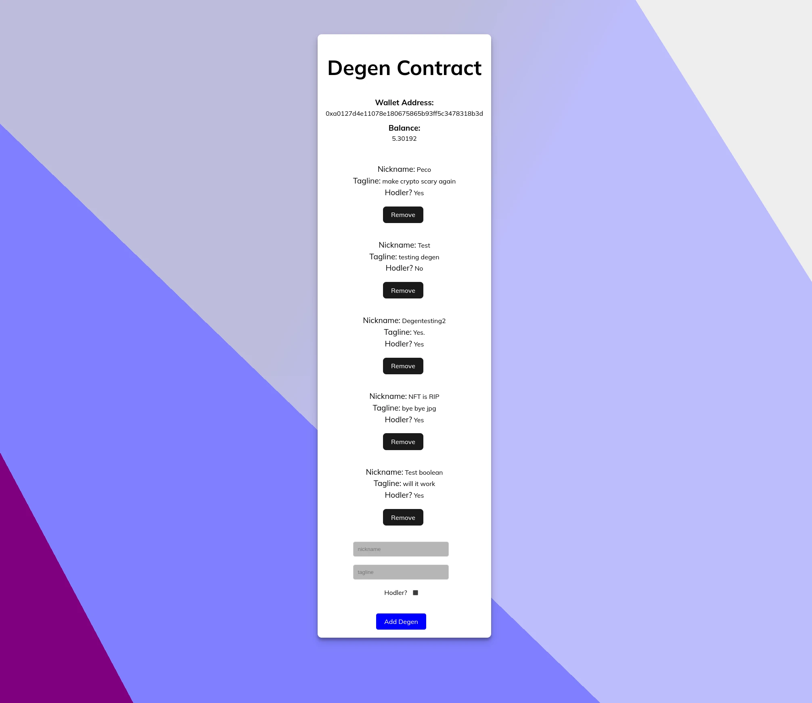

# Degen Contract

## What is this?

A project to practice React with a Solidity smart contract, Metamask and Ethers.js.

## Installation

1. npm install

2. npm install --save ethers

3. OPTIONAL: If you want to make your own Solidity contract edit this one below. Then deploy the contract on Sepolia via Remix.

```
SPDX-License-Identifier: MIT
pragma solidity >=0.4.22 <0.9.0;

contract DegenContract {
    uint nextId = 0;
    uint public numberOfDegens = 0;

    struct Degen {
        uint id;
        string nickname;
        string tagline;
        bool isHodler;
    }

    event DegenCreated(uint id);
    event DegenDeleted(uint id);
    event DegensIndex(uint[] ids);

    mapping(uint => Degen) public degens;
    uint[] public degenList;

    function createDegen(
        string memory _nickname,
        string memory _tagline,
        bool _isHodler
    ) public {
        nextId++;
        numberOfDegens++;
        degens[nextId] = Degen(nextId, _nickname, _tagline, _isHodler);
        degenList.push(nextId);
        emit DegenCreated(nextId);
    }

    function removeDegen(uint id) public {
        numberOfDegens--;
        delete degens[id];
        emit DegenDeleted(id);
    }

    function getIndexList() public view returns (uint[] memory) {
        return degenList;
    }

    constructor() {
        createDegen("Peco", "make crypto scary again", true);
    }
}
```

4. Change the contract address in the config.js on the last line

```
export const contractAddress = 'YOUR SMART CONTRACT ADDRESS';
```

5. Have fun degening! :desert_island:

## Screenshot :camera_flash:


