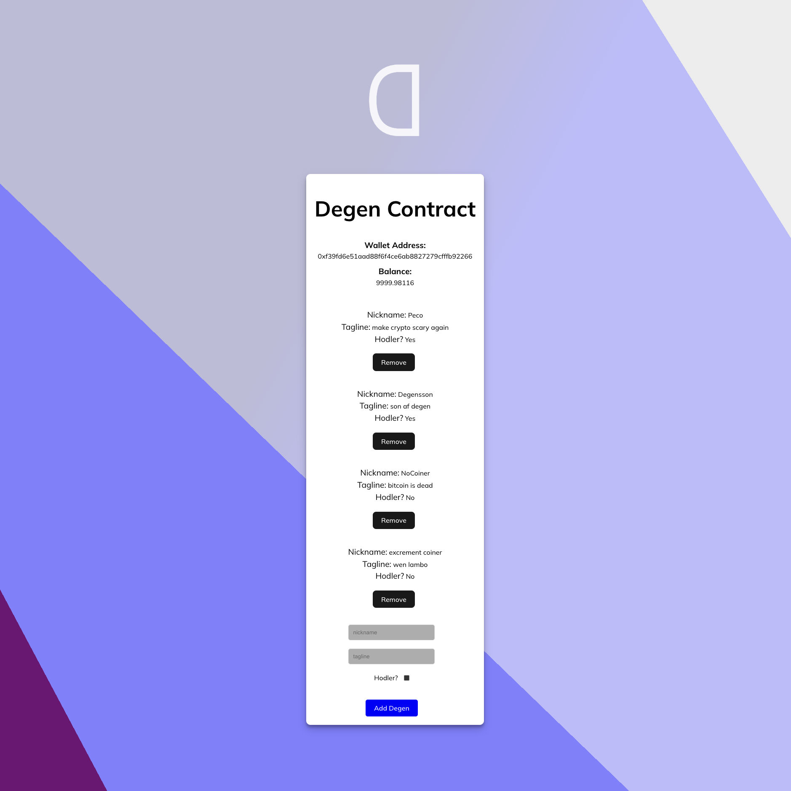

# Degen Contract

## What is this?

A project to practice React with Hardhat, Solidity smart contract, Metamask and Ethers.js.

## Installation

1. Clone the Repository

   `git clone https://github.com/codebatine/Degen-Contract.git`

2. Navigate to the Project Directory

   `cd Degen-Contract`

3. Install Dependencies

   `npm i -y`

4. Install Hardhat

   `npm i hardhat`

5. Set Up Metamask

   - Install the Metamask extension for your browser.
   - Create an account or import an existing one.
   - Connect to the Hardhat Network by clicking on the network dropdown (usually it will say "Ethereum Mainnet").
   - Select "Custom RPC" to add the Hardhat Network details:
     - Network Name: Hardhat
     - New RPC URL: http://localhost:8545
     - Chain ID: 31337
     - Currency Symbol (optional): ETH

6. Compile your smart contracts with:

   `npx hardhat compile`

7. Then deploy them to the Hardhat Network with:

   `npx hardhat run --network localhost scripts/deploy.js`

   Replace scripts/deploy.js with the path to your deployment script.

8. Update the Smart Contract Address

   After deploying your smart contracts, Hardhat will output the address of the deployed contract. You need to take this address and update your application's configuration to use it.

   Open the `config.js` file (or wherever your contract address is stored), and replace the existing contract address with the new one.

9. Run the Project

   `npm run dev`

## Screenshot :camera_flash:

